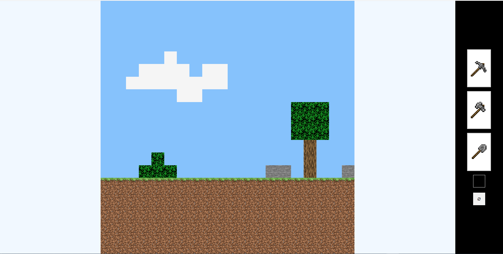
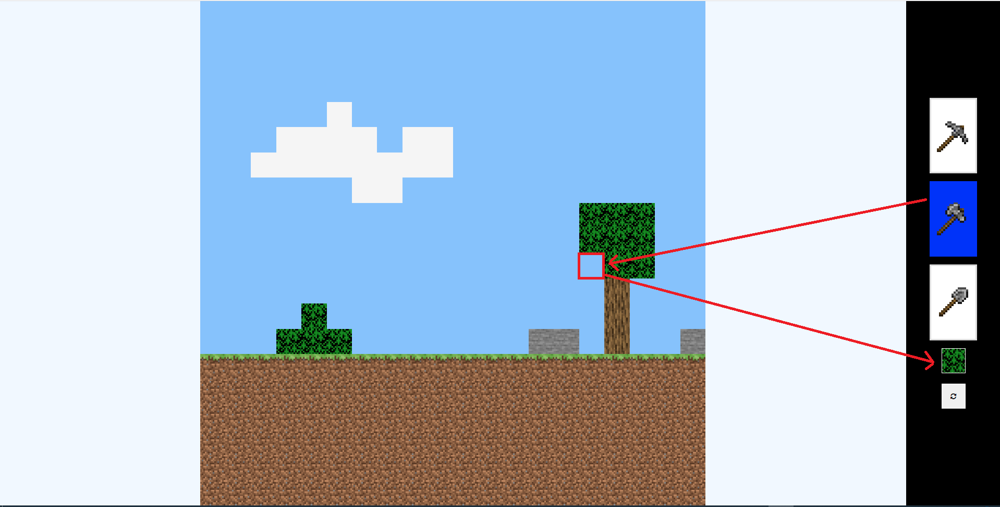
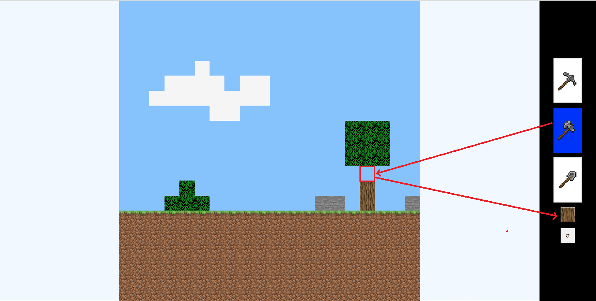
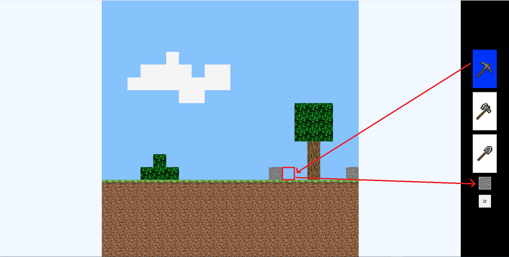
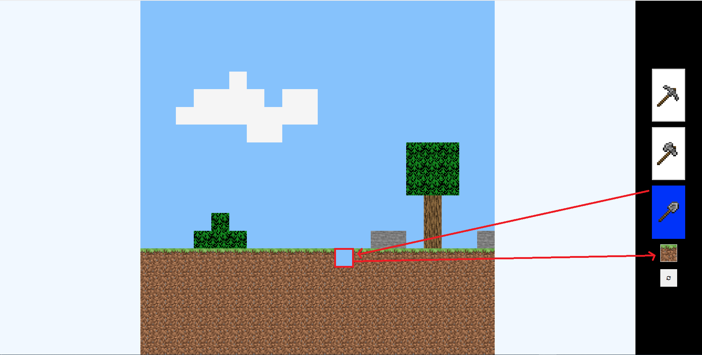
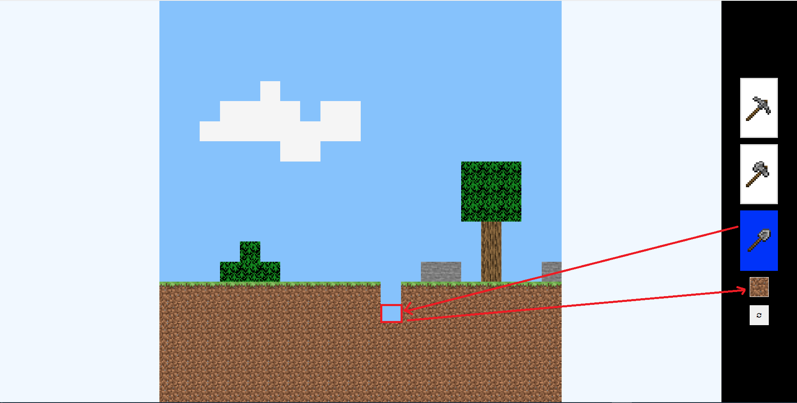
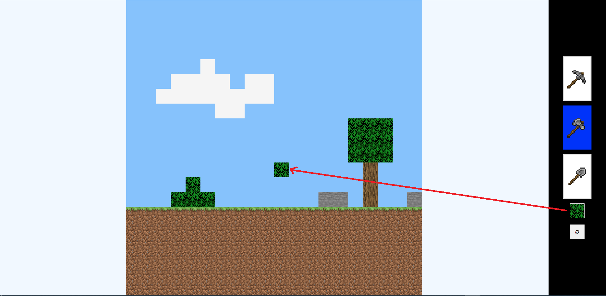

# 2D_Minecraft_Project

<!--  -->

<!-- You can **[Play](https://mystifying-wozniak-8ef33e.netlify.app/)** it -->

### **Design**

- The world is generated through a matrix using "createElement" function. Each number in the matrix has its own data-type and tile-image from the minecraft game.
- Each tool can "destroy" a different tiles n the grid and send it to the inventory.
- Clicking the inventory allows to re-build the tile back into the world anywhere on the game grid.

### **Technology used**

- This game was build in vanilla JavaScript, HTML, CSS
- The game is fully responsive.

### Start Page

### Game Page

<!--
### Aux

### Pickaxe

### Shovel

### Inventory

 -->
